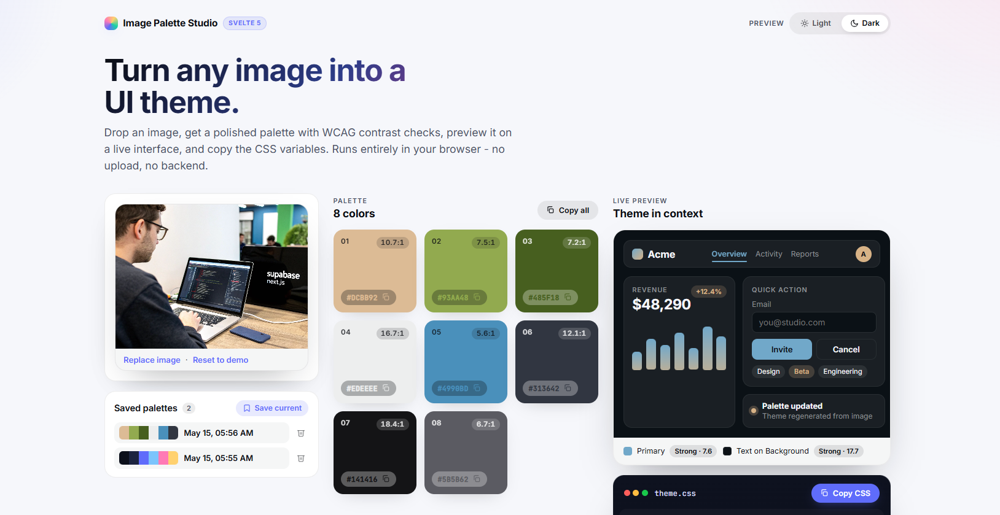

<div align="center">

# Image Palette Studio

**Turn any image into a UI theme — entirely in your browser.**

Drop an image, get a polished palette with WCAG contrast checks, preview a generated theme on a live dashboard, and copy ready-to-paste CSS variables. No uploads. No backend. No tracking.

[](https://kit.svelte.dev)
[](https://svelte.dev)
[](https://www.typescriptlang.org)
[](https://vitejs.dev)


<br />



</div>

---

## Highlights

- **In-browser palette extraction** — quantized color buckets via the Canvas API, scored by saturation and lightness, then deduplicated by perceptual distance.
- **Theme generation** — picks primary / accent / secondary by hue distance, tunes lightness for the chosen mode, and validates contrast.
- **WCAG contrast badges** on every swatch so you can see if a color is *Strong*, *Good*, or *Low* against its readable text.
- **Live preview** — a real dashboard mockup (nav, metric card, chart, buttons, tags, toast) that re-themes instantly. Toggle light/dark to stress-test the palette.
- **One-click CSS export** — `:root { --color-primary: ... }` ready to paste.
- **Saved palettes** persisted to `localStorage`, with one-click apply and delete.
- **Zero backend** — your images never leave the device. Works offline after first load.
- **Accessible by default** — keyboard navigable, `aria-live` status, respects `prefers-reduced-motion`.

## Quick start

```bash
npm install
npm run dev
```

Open [http://localhost:5173](http://localhost:5173) and drop in any image — a photo, a screenshot, an artwork.

### Other scripts

| Command           | What it does                                  |
| ----------------- | --------------------------------------------- |
| `npm run dev`     | Start the Vite dev server with hot reload     |
| `npm run check`   | Type-check the project with `svelte-check`    |
| `npm run build`   | Produce a production build                    |
| `npm run preview` | Serve the production build locally to verify  |

## How it works

### Palette extraction (`src/lib/color/extractPalette.ts`)

1. **Downscale** the image to a 144 px longest-edge thumbnail on a canvas — keeps the pixel count tractable.
2. **Quantize** each pixel's RGB into 24-unit buckets and tally how many pixels fall in each.
3. **Score** every bucket by `count × saturation_boost × lightness_penalty` — popular but characterful colors win; muddy near-black / near-white buckets are softened.
4. **De-duplicate** by Euclidean RGB distance, relaxing the threshold (60 → 40 → 24) until we have at least 6 distinct colors.
5. **Sort** the survivors by hue for a clean visual ramp.

Everything runs synchronously off the main thread in a few ms — small image, small math.

### Theme generation (`src/lib/color/theme.ts`)

- **Primary** — most saturated mid-lightness color.
- **Accent** — most saturated color whose hue is *farthest* from primary.
- **Secondary** — saturated color maximally distant from both.
- **Background / surface / border** — neutralized tints derived from the dominant hue, mode-aware.
- **Text / muted** — picked by best contrast against the chosen background.
- **Auto-rescue** — if primary or accent ends up too low-contrast against the background, lightness is re-tuned until it clears a 2.2 ratio floor.

### Contrast checks (`src/lib/color/contrast.ts`)

WCAG-style relative luminance and contrast-ratio math, used both to pick text colors and to render the per-swatch ratio badges.

## Tech stack

- **[SvelteKit 2](https://kit.svelte.dev)** + **[Svelte 5](https://svelte.dev)** (runes: `$state`, `$derived`, `$props`)
- **TypeScript** end-to-end
- **Vite 5** for dev and build
- **Canvas API** for pixel-level work — no image-processing libraries
- **CSS** custom properties + `color-mix()` for live theming
- **localStorage** for saved palettes

No runtime dependencies beyond the SvelteKit toolchain.

## Project structure

```
src/
├── app.css                  Global tokens, body gradient, reduced-motion
├── app.html                 SvelteKit shell + meta
├── lib/
│   ├── color/
│   │   ├── contrast.ts       WCAG luminance, contrast, HSL <-> RGB helpers
│   │   ├── extractPalette.ts Canvas-based palette extraction
│   │   └── theme.ts          Palette -> theme tokens
│   ├── components/
│   │   ├── ColorCard.svelte         One swatch (click to copy)
│   │   ├── CopyButton.svelte        Reusable copy-to-clipboard
│   │   ├── CssVariablesPanel.svelte CSS export with macOS window chrome
│   │   ├── ImageDropzone.svelte     Drop / pick / replace image
│   │   ├── ModeToggle.svelte        Preview light/dark toggle
│   │   ├── PaletteGrid.svelte       Responsive grid of ColorCards
│   │   ├── SavedPalettes.svelte     Local history with apply/delete
│   │   └── ThemePreview.svelte      Live dashboard mockup
│   └── types.ts             Shared types (ThemeTokens, SavedPalette, ...)
└── routes/
    ├── +layout.svelte
    └── +page.svelte         The whole app — composed of the components above
```

## Deploying

This is a pure client-side app — every route is static, no server code. Two easy targets:

- **Vercel** — import the repo; `@sveltejs/adapter-auto` will swap in `@sveltejs/adapter-vercel` automatically. No configuration needed.
- **Static host** (Netlify, Cloudflare Pages, GitHub Pages) — swap to `@sveltejs/adapter-static` in `svelte.config.js` for a fully static export.

## Roadmap ideas

- Export palette as `.ase` / Tailwind config / SCSS variables.
- Color-blindness simulation overlay on the live preview.
- Share-by-URL (palette hashed into the URL).
- Drag a color to reorder the palette before exporting.

## License

MIT — do whatever, just don't sue.

---

<div align="center">

Built by **[Satoshi](https://github.com/aozoragh)** · Source on [GitHub](https://github.com/aozoragh/image-palette-studio)

</div>
